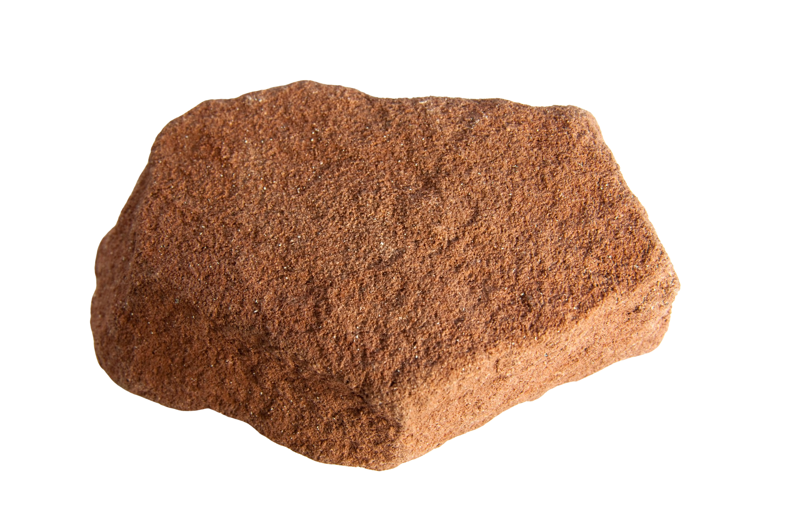

# Sandstone

> [!IMPORTANT]
> This is currently a work in progress.
> It is not ready to be used outside of dogfooding by developers of Sandstone itself.

Fine-grained Haskell builds with Nix's dynamic derivations.

Current demo:

```bash
"/tmp/sand/$( \
  /nix/store/5816ss5q8d8mpigj5wl0fp078dh2sy7j-nix-2.27.0pre19700101_dirty/bin/nix build \
  -L \
  --store /tmp/sand \
  --substituters 'http://cache.nixos.org' \
  --extra-experimental-features 'ca-derivations dynamic-derivations recursive-nix nix-command' \
  -f . dyn-drvs-test-res \
  --build-cores 20 -v --print-out-paths)"
```
(This is using the [pinned `nix`](./default.nix).)

Methodology:

- GHC's [ability to dump makefiles](https://downloads.haskell.org/ghc/latest/docs/users_guide/separate_compilation.html#dependency-generation)

- Nix's [dynamic derivations](https://nix.dev/manual/nix/latest/development/experimental-features#xp-feature-dynamic-derivations)
